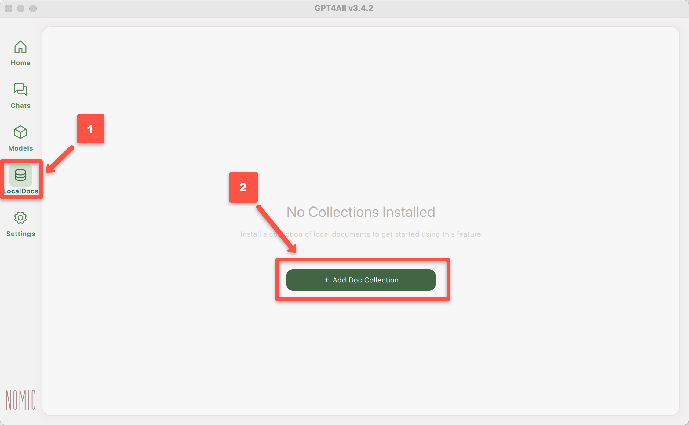
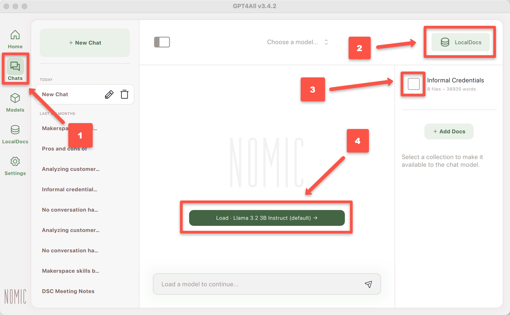

---
layout: default
title: 2 - GenAI for Local Documents
nav_order: 6
parent: Workshop Activities
customjs: http://code.jquery.com/jquery-1.4.2.min.js
--- 

# Use GPT4All to Query Local Documents

If you have any questions or get stuck as you work through this GPT4All exercise, please ask the instructor for assistance.

## LocalDocs Plugin Capabilities
The GPT4All _LocalDocs_ plugin allows you to query or ask questions about the contents of documents in a local folder on your computer.  LocalDocs works by creating and maintaining an index of all data in a folder on your computer that you specify. This index consists of small chunks of each document that the LLM can receive as additional input when you ask it a question. The general technique this plugin uses is called Retrieval Augmented Generation (RAG).

The main capabilities and limitations of the LocalDocs plugin include:

**LocalDocs Can:**
- Query groups of documents on your laptop with prompts or questions.
- The documents in specific folders on your computer that you specify will be searched for snippets that can be used to provide context for an answer.
- The most relevant snippets will be inserted into your prompts context, but it will be up to the underlying Large Language Model you have chosen to decide how best to use the provided context.
- **LocalDocs currently supports plain text files** (.txt, .md, and .rst) **and PDF files** (.pdf) only.

**LocalDocs Cannot:**
- Answer general metadata queries (e.g. What documents do you know about?, Tell me about my documents)
- **Summarize a single document** (e.g. Summarize my magna carta PDF.)

## Creating Your First LocalDocs Collection
Let's get started installing the LocalDocs plugin for GPT4All!

1. Open GPT4All on your laptop if you haven't already.
2. Select the **LocalDocs** button near the bottom of the left navigation bar.
4. Click on the green **+ Add Collection** button on the top right of the window.<br>
<br>
5. **Name**: Give your collection of documents on your laptop a descriptive name.
6. **Folder**: Next, click on the light green Browse button and navigate with your file manager to the location of the folder you want GPT4All to use as local training data.
8. Click on the green **Create Collection** button, to create your first local repository! It may take a minute or two for GPT4All to analyse all of the documents in the folder you selected.
> NOTE: You can set up multiple local document repositories.

## Ask Questions of your LocalDocs Collection
9. Click on the light green **Chats** button near the top of the left navigation bar.
10. Click on the light green **LocalDocs** button on the top right of the application.
11. Click the **checkbox** beside the name of your LocalDocs repository name.
12. Click on the dark green **Local...** button to select the Language Model you'd like to use.<br>
<br> 
13. Let's test _GPT4All & Llama 3 Instruct_ combined with your local document repository by asking it a question that you know the response to in your document library. For example, my local documents have information on informal credentials so I'll use the following query (**your prompt should be different**):<br>
```Are informal credentials students earn from academic makerspaces useful in helping them secure jobs?```<br>
  - How reasonable do the results look for your query?
  - Do you notice any significant errors or omissions that you know from what is in your local documents?
  - Have to tried asking for more details or for it to make a 500 word summary for example?
3. Make sure to ask another question or two that you know the answers to so that you can further evaluate the accuracy of the results! 
> - How did it do?
> - Any factual errors?
> - Any omissions?
  
[NEXT STEP: Local Excel Chat](3-local-excel-chat.html){: .btn .btn-blue }
