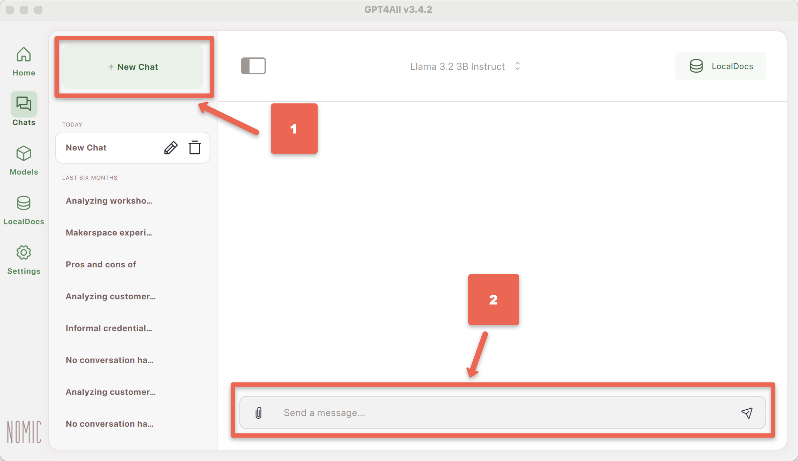
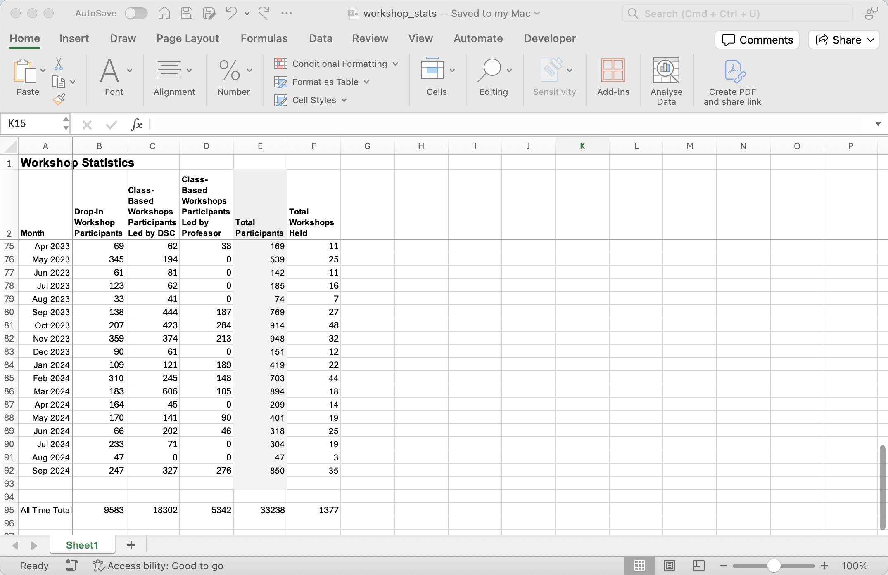
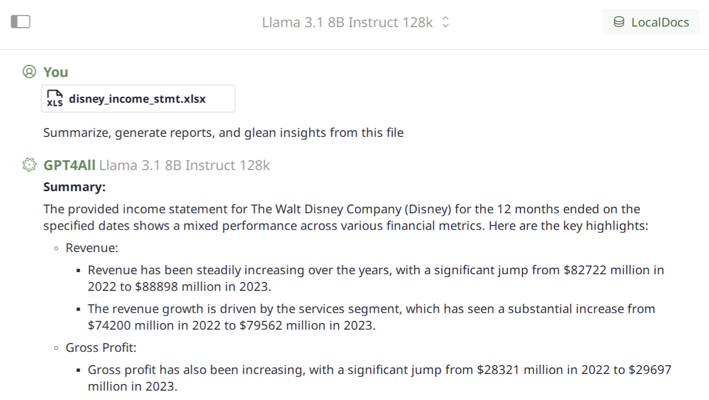

---
layout: default
title: 3 - Local Excel Chat
nav_order: 7
parent: Workshop Activities
customjs: http://code.jquery.com/jquery-1.4.2.min.js
--- 

# Local and Private AI Chat with your Microsoft Excel Spreadsheets

Microsoft Excel allows you to create, manage, and analyze data in spreadsheet format. By attaching your spreadsheets directly to GPT4All, you can privately chat with the AI to query and explore the data, enabling you to summarize, generate reports, and glean insights from your files—all within your conversation.


## Attach Microsoft Excel to your GPT4All Conversation

1. Navigate to the Chats view within GPT4All.<br>

2. Download the [example spreadsheet](images/workshop-stats.xlsx){:target="_blank"}, or use your own.<br>

3. Attach the spreadsheet to a GPT4All conversation.<br>

4. Have GPT4All Summarize and Generate a Report: ```Summarize, generate reports, and glean insights from this file.```<br>

6. How did it do? Do the summarized reports and insights sound reasonable? Or not?

## Limitations

It is important to double-check the claims LLMs make about the spreadsheets you provide. LLMs can make mistakes about the data they are presented, particularly for the LLMs with smaller parameter counts (~8B) that fit within the memory of consumer hardware.

Thanks to Nomic for inspiring this [spreadsheet analysis activity](https://docs.gpt4all.io/gpt4all_desktop/cookbook/use-local-ai-models-to-privately-chat-with-microsoft-excel.html#limitations){:target="_blank"}. 

[NEXT STEP: Local Sentiment Analysis](4-local-sentiment-analysis.html){: .btn .btn-blue }
