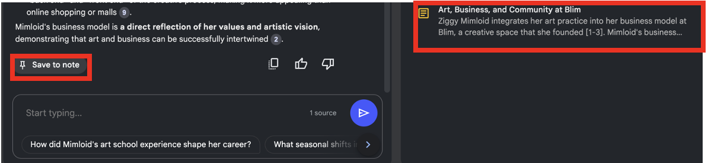

---
layout: default
title: 5 - COMING SOON - Qualitative Coding
nav_order: 9
parent: Workshop Activities
customjs: http://code.jquery.com/jquery-1.4.2.min.js
--- 
# COMING: DECEMBER 2024
# Generative AI for Research: Qualitative Coding

Years ago as a research assistant, I worked on a project to analyze social media posts related to a specific hashtag to identify the sentiment of the tweets. While the project was very interesting, the process of manually assigning a sentiment to over 2,000 tweets was not fun at all. The good news is that Generative AI can be a helpful & efficient tool for researchers wanting to conduct similar analyses today.

In this workshop, we will explore how to use GPT4All & Python for sentiment analysis, as well as Notebook LM for thematic analysis, while being mindful of their limitations. If you have any questions or get stuck as you work through this GPT4All exercise, please ask the instructor for assistance.

## Capabilities & Considerations of GPT4All
Generative AI tools like GPT4All allow researchers to more quickly, efficiently, and reliably identify the sentiment of a sentence or short paragraph, to uncover trends and patterns. 

### Pros of using generative AI for sentiment analysis:
- Efficiency: Automatically process vast amounts of textual data in a fraction of the time it would take manual analysis.
- Insight generation: Beyond sentiment classification, generative AI can extract themes, topics, and even generate summaries of responses.
- Research Ethics: If the GenAI tool runs locally on a researcher's laptop, and does not contact the cloud, no cloud-computing disclosures are likely needed in your research ethics proposal.

### Cons of using generative AI for sentiment analysis:
- Model limitations: While powerful, generative AI models may struggle with complex language, or sarcasm.
- Potential biases: Generative AI models inherit biases present in the training data, affecting the accuracy and fairness of results.

## Capabilities & Considerations of NotebookLM:
NotebookLM can be a real time saver when used for thematic analysis. It is an AI tool that can generate various insights relevant to qualitative research, such as summaries, trends in data, and synthesis of different sources. You can upload sources such as text, PDFs, websites, YouTube videos, audio files, .txt files, Google Docs or Google Slides. Please note that Word documents will need to be converted into a .txt file or Google Doc, or pasted as text.

### Pros of using NotebookLM for thematic analysis:
Using NotebookLM can save you time, enhancing the efficiency of qualitative data analysis. Here are some key advantages of using this tool:
Data Organization and Synthesis: NotebookLM excels at synthesizing information from multiple documents. It allows users to create notebooks for specific projects and import relevant documents, enabling quick access to organized data.

Custom Dataset Definition: Unlike traditional AI tools that scrape the internet for information, NotebookLM allows users to define their own datasets. This means researchers can input their own notes, articles, and other qualitative data, ensuring that the AI works with reliable and relevant sources.

Efficient Information Retrieval: The tool can act as a virtual research assistant, capable of answering questions and tracking down references in the text based on the sources provided. This feature can save researchers significant time when searching for specific information within their qualitative data.

Enhanced Analysis Capabilities: NotebookLM can analyze text and identify themes, patterns, and insights within qualitative data. This capability can help researchers uncover implicit meanings and connections.

### Cons of using NotebookLM for thematic analysis:

It is important to note that insights generated by NotebookLM and other generative AI tools are not final products, but starting points for analysis. Outputs must be reviewed for accuracy and the following drawbacks must be taken into consideration:

Limited Understanding of Nuance: Although NotebookLM can analyze text and identify themes, it may struggle with the nuanced understanding of complex human emotions and motivations that qualitative research often requires. AI tools, including NotebookLM, may not fully capture the subtleties of human experience, which can lead to oversimplified interpretations of qualitative data.

Dependence on Input Quality: The effectiveness of NotebookLM is heavily reliant on the quality and relevance of the data inputted by the user.

Potential for Bias: Like many AI tools, NotebookLM can inadvertently reflect biases present in the training data or the input data provided by users. This can result in skewed analyses or interpretations that do not accurately represent the diversity of perspectives within qualitative research.

Lack of Human Insight: While NotebookLM can generate analyses and summaries, it lacks the human touch that is often crucial in qualitative research. Researchers bring their own insights, experiences, and contextual understanding to their work, which an AI tool cannot replicate.

Privacy Limitations: Unlike other AI tools, NotebookLM does not use your data for training purposes. However, your anonymized data will still go through external servers - this will need to be disclosed in your research ethics application and to research participants prior to beginning your research. To our knowledge, free AI tools that run on your local computer, such as GPT4All, are not as effective for analyzing qualitative data.

### Common uses for NotebookLM that are relevant for qualitative research

Summarization 

An LLM can help you summarize many types of texts: reports, customer surveys, meeting notes, emails, and more. For example, the following prompt asks an LLM to provide a summary of a lengthy email: 

_The following text is an email from a software vendor. Summarize its main points in a bulleted list:_

The prompt begins with useful context about the relevant email. Next, it clearly states that the task is to summarize the main points of the email. Finally, it specifies that the output should be formatted as a bulleted list. 

Note: Be aware that LLMs can sometimes hallucinate, or produce AI outputs that aren’t true. In this case, the LLM might add details to the summary that aren’t included in the source email. Always evaluate LLM output for accuracy before using it. 

Classification 

Text classification is another common application for LLMs. For example, an LLM can help you categorize content in social media posts, and analyze sentiments or feelings in survey feedback. The following prompt asks an LLM to analyze the sentiment in a survey response: 

_Read these survey responses and tell me whether the sentiment of the survey response is positive, negative, or neutral._

The prompt begins by clearly stating that the task is to analyze the sentiment of a customer review and then specifies the options: positive, negative, or neutral. Then, the prompt includes the relevant reviews under the label “Survey Response.”

## Thematic Analysis with NotebookLM

In this activity, you will use NotebookLM to identify and synthesize key themes/ideas from interviews with artists.

1. Go to https://notebooklm.google/ and click “Create new.” Once you’ve created a project, it will be saved on your home page.

 

2. To add a source, select “Website” under Link and paste the following link: https://www.sadmag.ca/blog/2024/8/28/sell-out-a-series-5-questions-with-ziggy-mimloid 

 

3. You can now explore some of the suggested questions or features in the Notebook Guide generated by clicking on them. You can find more information about these features in the NotebookLM Learning Activity. You can click “Notebook guide” in the bottom right at any point to pull it up again. 

 

4. NotebookLM’s responses can be saved in this notebook using the “Save to note” button. 

 

5. To view your notes, close the chat by clicking the X mark on the top right or “Close Chat” on the bottom left. To re-open the chat, click “View Chat” on the bottom left. NotebookLM’s responses contain references to quotes. If you click the numbers at the end of sentences, you will see the original quotes on the left panel. Highlighting passages of text in this left panel will generate prompts at the bottom of the chat panel, including creating a new note with the passage or a summary of the passage. You can find related ideas in the text using the “Suggest related ideas” button, or an explanation of the highlighted passage using the “Help me understand” button.

 

6. To synthesize two interview transcripts, close the right panel if it is open and click the plus symbol beside “Sources” in the top left. Then, enter the following link: https://www.sadmag.ca/blog/2024/8/28/sell-out-a-series-5-questions-with-anne-sueyeun-seol

 

7. Both sources will be automatically selected by default. You can select which sources you want to analyze by using the check marks.

 

8. In the text box, enter prompts to find commonalities between the two articles, such as “Synthesize the two interviews” or “Identify common themes from both interviews.” Prompts can also depend on the insights you are looking for; a more specific example could be “Identify common approaches to balancing livelihoods and creativity among both artists interviewed.

9. To re-name your project from the automatic title generated from the first source, click the title at the top. All chat responses and notes will then be saved under this title when you navigate to the home page. To share results, click the “Share” button on the top right.

 

  
[NEXT STEP: Earn a Workshop Badge](informal-credentials.html){: .btn .btn-blue }
