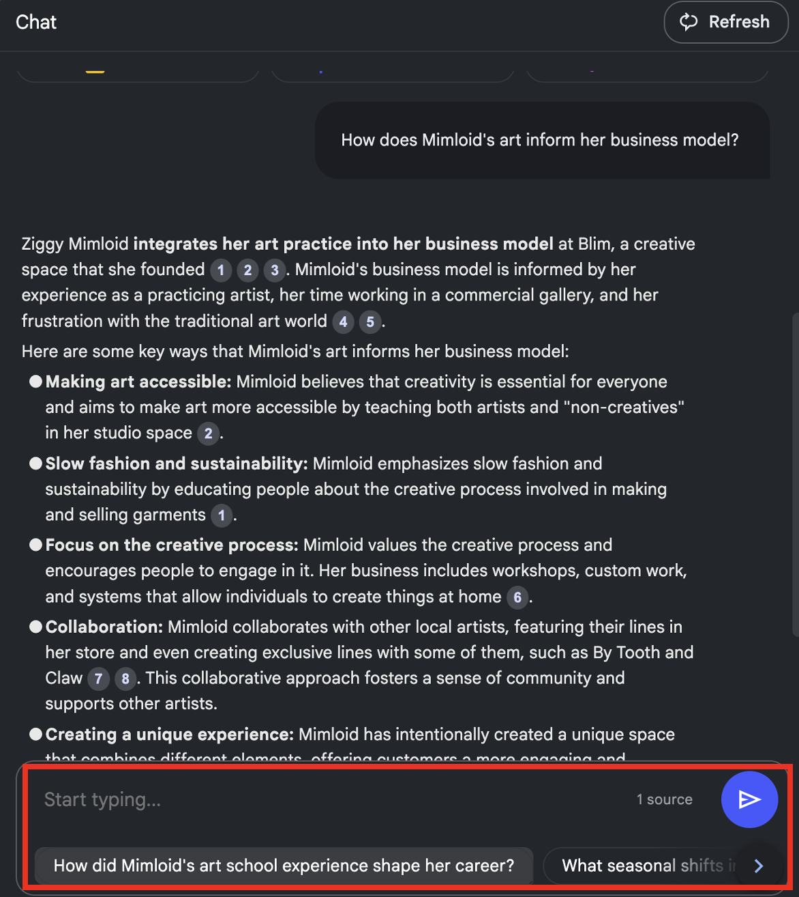

---
layout: default
title: 5 - Qualitative Coding
nav_order: 9
parent: Workshop Activities
customjs: http://code.jquery.com/jquery-1.4.2.min.js
--- 
# Generative AI for Research: Qualitative Coding


NotebookLM can be a real time saver when used for qualitative coding. It is an AI tool that can generate various insights relevant to qualitative research, such as summaries, trends in data, and synthesis of different sources. You can upload sources such as text, PDFs, websites, YouTube videos, audio files, .txt files, Google Docs or Google Slides. Please note that Word documents will need to be converted into a .txt file or Google Doc, or pasted as text.

## Pros of using NotebookLM for thematic analysis:
Using NotebookLM can save you time, enhancing the efficiency of qualitative data analysis. Here are some key advantages of using this tool: 
- **Data Organization and Synthesis**: NotebookLM excels at synthesizing information from multiple documents. It allows users to create notebooks for specific projects and import relevant documents, enabling quick access to organized data.
- **Custom Dataset Definition:** Unlike traditional AI tools that scrape the internet for information, NotebookLM allows users to define their own datasets. This means researchers can input their own notes, articles, and other qualitative data, ensuring that the AI works with reliable and relevant sources.
- **Efficient Information Retrieval:** The tool can act as a virtual research assistant, capable of quickly answering questions and tracking down references in the text based on the sources provided.
- **Enhanced Analysis Capabilities:** NotebookLM can analyze text and identify themes, patterns, and insights within qualitative data. This capability can help researchers uncover implicit meanings and connections.

## Cons of using NotebookLM for thematic analysis:
It is important to note that insights generated by NotebookLM and other generative AI tools are not final products, but starting points for analysis. Outputs must be reviewed for accuracy and the following drawbacks must be taken into consideration:
- **Limited Understanding of Nuance:** Although NotebookLM can analyze text and identify themes, it may struggle with the nuanced understanding of complex human emotions and motivations that qualitative research often requires. NotebookLM may not fully capture the subtleties of human experience, which can lead to oversimplified interpretations of qualitative data.
- **Potential for Bias:** Like many AI tools, NotebookLM can reflect biases present in the training data or the prompt data provided by users. This can result in skewed analyses or interpretations that do not accurately represent the diversity of perspectives within qualitative research.
- **Lack of Human Insight:** While NotebookLM can generate analyses and summaries, it lacks a human perspective that is often crucial in qualitative research. Researchers bring their own insights, experiences, and contextual understanding to their work, which an AI tool cannot replicate.
- **Privacy Limitations:** NotebookLM does not use your data or prompts for training purposes. However, your data will still be processed on servers located in the United States - this will need to be disclosed in your research ethics application and to research participants prior to beginning your research. Currently, GenAI tools that run on a personal computer, such as GPT4All, are not as effective for analyzing qualitative data.

## Thematic Analysis with NotebookLM
In this activity, you will use NotebookLM to identify and synthesize key themes/ideas from interviews with artists.

1. Go to [https://notebooklm.google/](https://notebooklm.google/){:target="_blank"} and click **Create new**. Once you’ve created a project, it will be saved on your home page.
<br>
2. To add a source, select “Website” under Link and paste the following link: ```https://www.sadmag.ca/blog/2024/8/28/sell-out-a-series-5-questions-with-ziggy-mimloid```
<br>
3. The NotebookLM interface is divided into three panes: a list of sources on the left, a chat window in the middle where you can ender prompts, and a Sources pane on the right, where saved notes will appear. To generate an overview of the document, click the **Briefing doc** button either in the chat window our Sources pane. This will automatically generate a note under the notes section of the Sources pane.
<br>
5. Click on a note to open it, and click on the title to rename it. You can close the note by clicking on the minimize button on the top right.
6. To explore your data, you can either click on suggested questions at the bottom of the chat or enter your own.
<br>
7. In the generated response in the chat, clicking on the numbered references will highlight relevant passages in the source text. This feature is only available in the chat window and isn't available in saved notes.
8. Save chat responses as notes by clicking the **Save to note** button. 
<br>
9. Explore the source guide by clicking the title of the source (not the check mark) in the left pane. Clicking on any of the Key topics generated will prompt an overview of the topic in the chat.
<br>
10. To add another source that can be synethesized with the current source, close the right panel if it is open and click the plus symbol beside **Sources** in the top left. Then, enter the following link: ```https://www.sadmag.ca/blog/2024/8/28/sell-out-a-series-5-questions-with-anne-sueyeun-seol```
11. Both sources will be automatically selected by default. You can select which sources you want to analyze by using the check marks.
<br>
12. In the text box, enter prompts to find commonalities between the two articles, such as ```Synthesize the two interviews``` or ```Identify common themes from both interviews.``` Prompts can also depend on the insights you are looking for; a more specific example could be ```Identify common approaches to balancing livelihoods and creativity among both artists interviewed.```
13. To re-name your project from the automatic title generated from the first source, click the title at the top. All chat responses and notes will then be saved under this title when you navigate to the home page. To share results, click the **Share** button on the top right.
<br>

  
[NEXT STEP: Earn a Workshop Badge](informal-credentials.html){: .btn .btn-blue }
